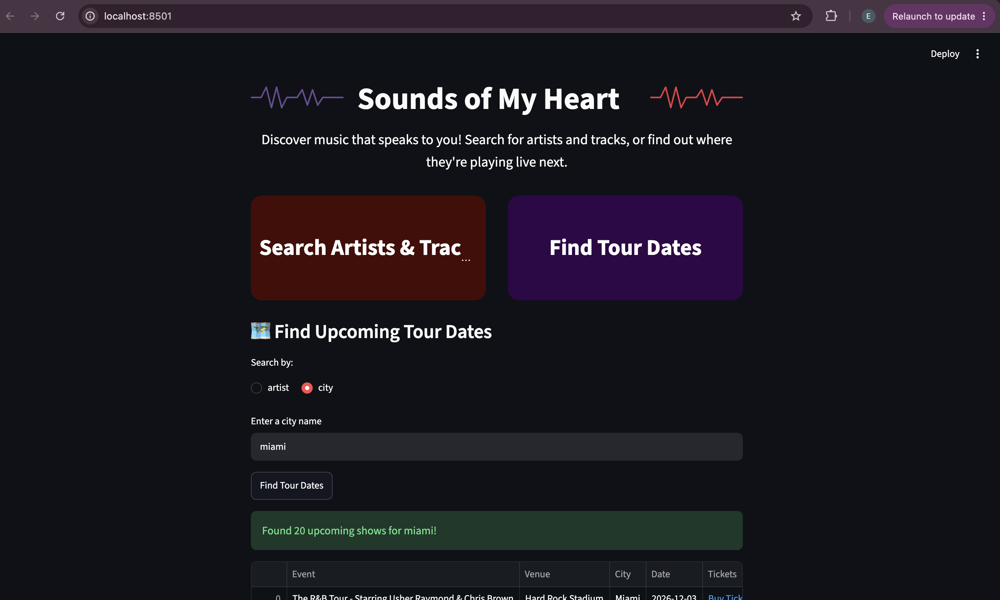
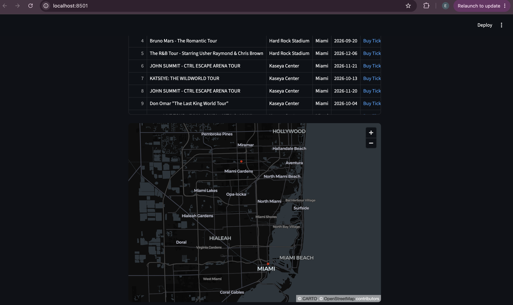
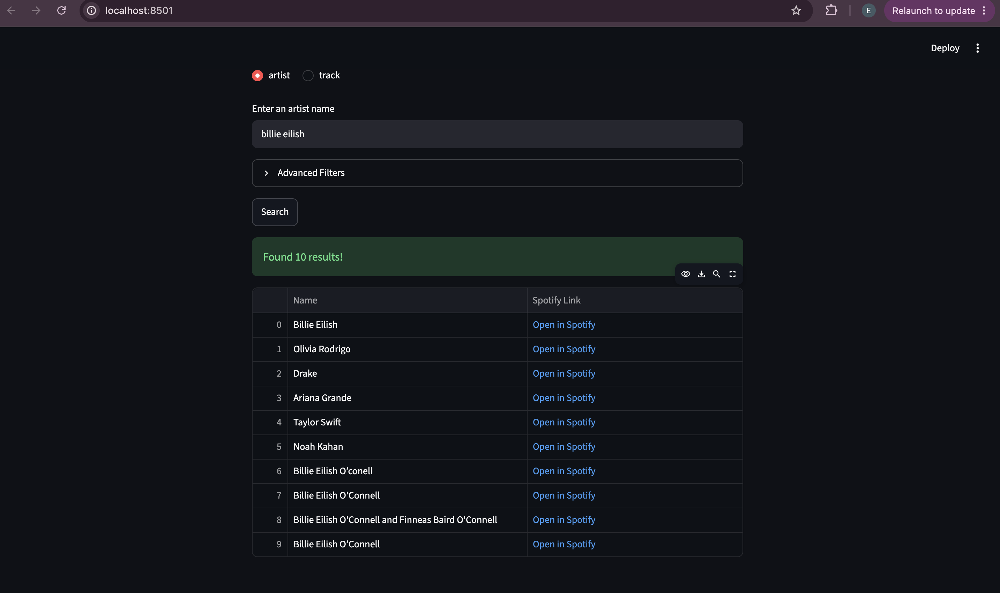

# Sounds of My Heart 🎵

A small Streamlit app for discovering music: search Spotify for artists and tracks, or look up upcoming live tour dates by artist or city (via Ticketmaster), plotted on a map.

## Features

- Search artists or tracks on Spotify, with optional year and explicit-content filters
- Look up upcoming shows by artist or city via Ticketmaster
- View tour dates on an interactive map

## Screenshots

## Setup

See [IntructionsToRunApp.txt](IntructionsToRunApp.txt) — you'll need a `.env` file with your own Spotify and Ticketmaster API credentials (see `.env.example`).
